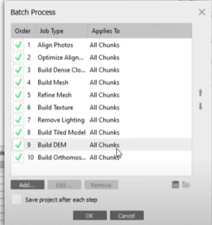
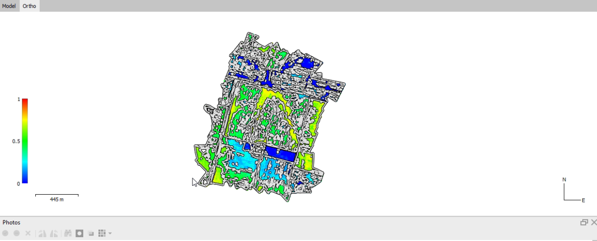

# Crop Yield Estimation using Multispectral Imaging

The Hyperspectral Imaging for Crop Potential Estimation project utilizes hyperspectral imaging technology to analyze crop areas and estimate their potential using the Normalized Difference Vegetation Index (NDVI) calculation. The project involves the processing of hyperspectral image data in Agisoft software and leveraging the NDVI metric to assess the health and vigor of crops.

Key features of the Hyperspectral Imaging for Crop Potential Estimation project include:

- ## Hyperspectral imaging:
 The project employs advanced hyperspectral imaging techniques to capture detailed spectral information of crop areas. Hyperspectral sensors capture a wide range of electromagnetic wavelengths, providing rich data for analysis.
- ## Agisoft software: 
The project utilizes Agisoft software, a powerful tool for processing and analyzing hyperspectral image data. Agisoft software enables efficient extraction and manipulation of spectral information.
- ## NDVI calculation: 
The project performs the Normalized Difference Vegetation Index (NDVI) calculation using the hyperspectral data. NDVI is a widely used index that quantifies vegetation health by measuring the difference in reflectance between visible and near-infrared bands.
- ## Crop potential estimation: 
Based on the NDVI values obtained, the project estimates the crop potential of the analyzed areas. NDVI values serve as an indicator of vegetation health and can provide insights into crop growth, stress levels, and overall potential yield.
- ## Data visualization and analysis: 
The project includes data visualization and analysis components to present the results in an intuitive and meaningful way. Visualizations can include maps, charts, or other graphical representations to showcase the estimated crop potential across the analyzed areas.
## 

The Hyperspectral Imaging for Crop Potential Estimation project offers valuable insights for agricultural monitoring, precision farming, and crop management. It enables farmers, agronomists, and researchers to assess and optimize crop potential, identify areas of concern, and make data-driven decisions to enhance agricultural productivity.

Project - 22

## Table of Contents
- [Process](#process)
- [Uses](#uses) 
- [Contributing](#contributing)
- [Feedback and Suggestions](#feedback-and-suggestions)

## Process 
- First we need to upload the multispectral images into agisoft software
- Pass the batch process

- Then you get your orthomosaic file and DEM file 

- Go to Raste Calculator and put the NDVI formula
- Generate Prescription Map 

For more details follow Project Report- Soyabean.docx

## Uses
- It helps to farmers to know their crop potential of crop area 
- It can be used in agricultural analysis
## Contributing

Contributions are welcome! If you'd like to contribute to this project, please follow these steps:

 1. Message your ideas on my [WhatsApp](https://api.whatsapp.com/send/?phone=919777795786&text=Hello%20Shaikh%20Habibur%20Rehaman,%20I%20get%20this%20no.%20from%20your%20Github%20&type=phone_number&app_absent=0)

## Feedback and Suggestions

If you have any feedback or suggestions for improving this model, please feel free to reach out to me. You can contact me via email at s.h.rehaman.art@gmail.com or through WhatsApp at [Just Say Hello 👋 ](https://api.whatsapp.com/send/?phone=919777795786&text=Hello%20Shaikh%20Habibur%20Rehaman,%20I%20get%20this%20no.%20from%20your%20Github%20&type=phone_number&app_absent=0)
